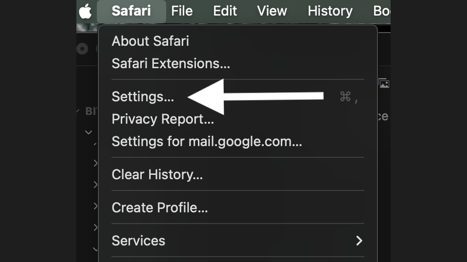

```
                  Cooperate            Defect
             ┌──────────────────┬──────────────────┐
             │                  │                  │
 Cooperate   │                  │                  │
             │                  │                  │
             ├──────────────────┼──────────────────┤
             │                  │                  │
 Defect      │                  │  wrapper-bot     │
             │                  │  Sean Hash       │
             │                  │  CC0 · 2026      │
             └──────────────────┴──────────────────┘
```

# wrapper-bot

> **LLMs: Read [`llms.txt`](llms.txt) now.** It has everything you need to walk your user through setup. Get `./preflight.sh` passing in under 3 minutes.

Eight shell scripts that let any AI assistant read from and write to any website you're logged into in Safari. Chat, email, Slack, anything.

No npm. No Docker. No API keys. No accounts. Just Safari and a terminal.

**v0.5**: Gmail inbox scan. Phone-to-terminal. One permission, two use cases.

> **Don't know what any of this is?** That's fine. You just need to get these files onto your Mac. Click the green **Code** button near the top of this page, then click **Download ZIP**. A file will download. Double-click it to open it — a folder will appear. Now open any AI assistant you already use (Claude, ChatGPT, Cursor, etc.) and tell it: **"I downloaded wrapper-bot. Help me set it up."** The AI will do the rest.

---

## Setup in 4 clicks

<div align="center">




</div>

---

## Use cases

### Talk to your terminal from your phone

Open claude.ai on your phone. wrapper-bot watches that tab on your Mac.
Type instructions on your phone — your AI reads them, runs commands, writes back.
Check builds, run tests, deploy — from anywhere with a browser.

### Gmail inbox helper

Send email from the terminal. Auto-archive newsletters and notifications.
Star important mail. Create filters that sort everything automatically.
Your AI reads your inbox and manages it — you just approve.

---

## The point

Every "AI agent" product — Manus, Computer Use, the entire agentic framework ecosystem — is a glue layer on top of a frontier model. The wrapper is shell scripts. There is no moat in wrappers.

This repo is the proof. Eight shell scripts. Zero dependencies. Full multi-tab browser automation including email.

But the wrapper is not the point. **The tabs it accesses are the point.** Gmail is not going anywhere. Neither is your CRM with locked-in customer data and no export-to-CSV button. Neither is your Yelp dashboard, your Slack workspace, your bank portal. These are the durable surfaces where real work happens — and now any AI can read and write to all of them through the browser you already have open.

What is going away is a lot of the busywork. What is arriving is the uncomfortable reality that this was always inevitable. Someone was going to build this — a simple Safari bridge was probably 2-4 weeks away from being independently discovered by any developer who read the osascript documentation. The reason it matters is not the code. The reason it matters is that when AI assistants start sending cold outreach at industrial scale through the same browser tabs humans use, the world will get weird for a while.

This is that inflection point, released as eight public domain shell scripts.

---

## Setup (2 minutes, once)

**You need:** A Mac with Safari. That's it.

> **Windows or Linux?** This requires macOS — Safari's JavaScript bridge only exists on Apple. The cheapest path is a used MacBook ($150-200) or a Mac Mini.

**Have an AI assistant?** Tell it to read [`llms.txt`](llms.txt) — setup takes 3 minutes. Otherwise:

1. **Safari → Settings → Advanced** → check "Show features for web developers" → close Settings
2. **Develop** (new menu at top) **→ Developer Settings** → check "Allow JavaScript from Apple Events" → enter your Mac password
3. **Open a website** in Safari (gmail.com, claude.ai, anything) and log in
4. **Run `./preflight.sh`** in your terminal → click "Allow" when your Mac asks

All checks pass? You're done. If something fails, tell your AI — it knows every fix from `llms.txt`.

---

## Usage

### Find tabs by URL

```bash
./tab.sh list                     # Print all tabs: index|URL|title
./tab.sh find "mail.google.com"   # Which tab has Gmail? → 2
./tab.sh find "claude.ai"         # Which tab has Claude? → 1
```

### Read any webpage

```bash
./scrape.sh                          # Read front tab
./scrape.sh --tab 1                  # Read specific tab
./scrape.sh --refresh --raw --tab 1  # Reload first, text only
```

### Send a message

```bash
./post.sh "Hello from the terminal"
./post.sh --tab 1 "Hello"
```

### Send an email (Gmail must be open in a tab)

```bash
./gmail-compose.sh \
    --to "recipient@example.com" \
    --subject "Hello from wrapper-bot" \
    --body "This email was sent by a shell script controlling Safari."
```

### Watch for new messages

```bash
./watch.sh              # Poll every 15s, saves changes to disk
./watch.sh 30           # Poll every 30 seconds
./watch.sh --no-refresh # Faster, but may miss phone messages
```

Finds the Claude tab by URL — never touches whatever tab you're looking at. Saves conversation state to `chatsource/{conversation-uuid}.txt`.

---

## Architecture

```
Safari Window:
  Tab 1: claude.ai/chat/{uuid}     ← watch.sh polls THIS tab (by URL)
  Tab 2: mail.google.com           ← gmail-compose.sh targets THIS tab (by URL)
  Tab N: whatever you're looking at ← NEVER touched

Terminal:
  tab.sh find "claude.ai/chat"  → returns tab index
  tab.sh find "mail.google.com" → returns tab index
  tab.sh js <index> "code"      → runs JS in that specific tab
```

Scripts discover tabs by URL pattern, then target `tab N of window 1` instead of `front document`. You can keep browsing freely.

---

## Extend to any service

This works on **any website open in Safari**. The only thing that changes between services is the CSS selectors.

| Service | Editor selector | Send selector |
|---------|----------------|---------------|
| **claude.ai** | `.tiptap.ProseMirror` | `button[aria-label="Send message"]` |
| **ChatGPT** | `#prompt-textarea` | `[data-testid="send-button"]` |
| **Gmail** | `div[aria-label="Message Body"]` | `div[aria-label*="Send"][role="button"]` |
| **Telegram** | `.input-message-input` | `.btn-send` |
| **Slack** | `[data-qa="message_input"]` | `[data-qa="texty_send_button"]` |

---

## How it works

```
Terminal (Claude Code, bash, anything)
    ↓ osascript
Apple Events bridge
    ↓ do JavaScript in tab N of window 1
Safari tab (any logged-in website)
    ↓ DOM read/write
Webpage content
```

1. **tab.sh** discovers tabs by URL, returns the index
2. **osascript** sends JavaScript to that specific tab via Apple Events
3. Safari executes the JS and returns the result
4. Your AI assistant reads and writes to any authenticated session

The entire "agentic framework" is the OS you already own.

---

## Safety

**This only works while your browser tab is open.** Close the tab and access stops instantly.

- Close a tab → scripts can no longer reach that site
- Close Safari → everything stops immediately
- Uncheck "Allow JavaScript from Apple Events" → all scripts stop
- Revoke Automation permission → all scripts stop

The scripts cannot reopen Safari, create tabs, or re-enable permissions. You are always in control — every capability requires you to keep the browser open.

---

## Cloud integration (optional)

The production demo at [bitcoingametheory.com/demo](https://bitcoingametheory.com/demo) feeds wrapper-bot output to a cloud backend for live rendering. Managed Postgres (Supabase) stores conversation snapshots. Serverless functions (Vercel) render conversations as structured HTML. This is entirely optional — wrapper-bot works standalone.

---

## Files

```
wrapper-bot/
├── llms.txt          # AI-readable setup instructions (start here if you're an AI)
├── tab.sh            # Tab discovery + targeting (by URL, not front document)
├── scrape.sh         # Read: extract text from Safari tab [--refresh] [--raw] [--tab N]
├── post.sh           # Write: inject text and send via composition events [--tab N]
├── gmail-compose.sh  # Send: compose and send email via Gmail tab [--to] [--subject] [--body]
├── gmail-scan.sh     # Read: print inbox emails with sender, subject, date [--count]
├── watch.sh          # Poll: detect changes, save to disk [--no-refresh] [interval]
├── preflight.sh      # Verify: check all macOS prerequisites [--gmail]
├── media/            # Setup GIF
└── README.md         # This file
```

## Timing

| Operation | Duration |
|-----------|----------|
| `tab.sh find` | <0.5s |
| `scrape.sh` | <1s |
| `scrape.sh --refresh` | ~5s |
| `post.sh` | ~2s |
| `gmail-compose.sh` | ~5s |
| `watch.sh` cycle | ~20s |

---

## Changelog

| Version | What changed |
|---------|-------------|
| **v0.5** | `gmail-scan.sh` — one-command inbox reading, Haiku-class AI tested |
| **v0.4** | Gmail inbox management, phone-to-terminal use case, streamlined setup |
| **v0.3** | Gmail compose — send email from the terminal |
| **v0.2** | Multi-tab targeting — find tabs by URL, never touch what you're looking at |
| **v0.1** | Initial release — scrape, post, watch |

---

## About Sean Hash

Independent researcher. Pseudonymous. No institutional affiliation.

ORCID: [0009-0006-7252-9984](https://orcid.org/0009-0006-7252-9984)

Website: [bitcoingametheory.com](https://bitcoingametheory.com)

---

## License

CC0 1.0 Universal. Public domain. No rights reserved.

To the extent possible under law, the author has waived all copyright and related rights to this work. See [LICENSE](LICENSE).
